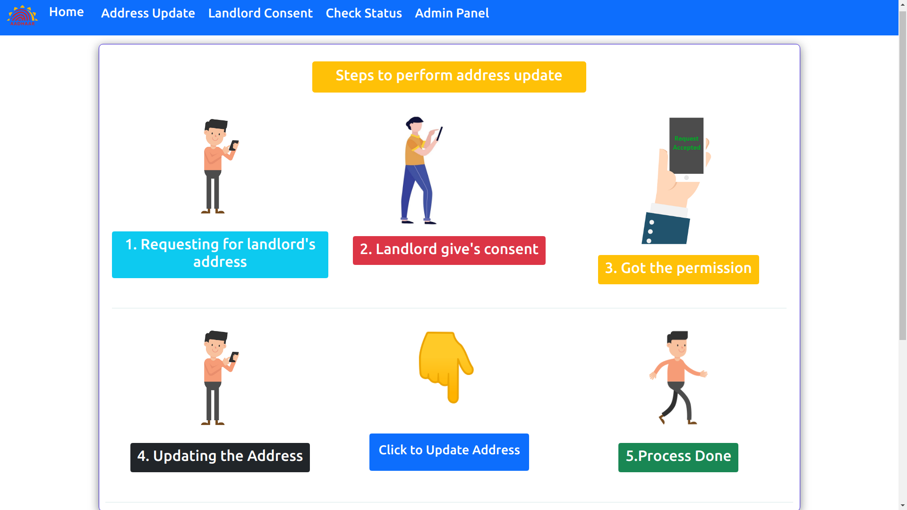

# Team Name - Team Pentagon

## Problem Statement - Address Update Challenge in Urban Areas

### Check out the [Video](https://firebasestorage.googleapis.com/v0/b/shree-server.appspot.com/o/App%2FPentagon.mp4?alt=media&token=1da41c63-ce2a-4593-82ab-2e1beb020d8c)

# Features
- Real-time address update.
- Audit Logs are maintained at every step.
- Offline e-KYC extraction.
- Offline e-KYC automatically gets deleted after address update.
- Simple and User Friendly UI/UX.
- Fully Responsive on all kind of devices.

# Tech Stack Used
- HTML5
- CSS3
- Bootstrap5.1
- JavaScript
- Ajax
- Python
- Django
- Sqlite3

# API Used
- Aadhaar VID Wrapper
- Aadhaar Offline eKYC API
- Geo-Coder API
- Fast2SMS API

# How to fork and run on your local machine 💻:

  * Download and install Python
  * Download and install Git.
  * Fork the Repository.
  * Clone the repository to your local machine `$ git clone https://github.com/PrabhatP2000/pentagon-aadhaar.git`
  * Change directory to pentagon-aadhaar `$ cd pentagon-aadhaar`
  * Install the requirements: `$ pip install -r requirements.txt`
  * Make migrations `$ python manage.py makemigrations`
  * Migrate the changes to the database `$ python manage.py migrate`
  * Create admin `$ python manage.py createsuperuser`
  * Run the server `$ python manage.py runserver`
  * Open any web browser and then paste the server address to see the webpage working on your local machine
